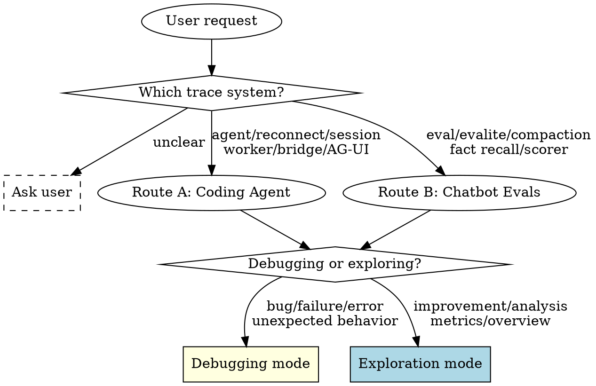

# Trace Analyzer

This monorepo has two trace systems. Route first, then determine your mode.



## Debugging Mode

**REQUIRED PAIR SKILL:** Use `superpowers:systematic-debugging` for the debugging process. This skill provides the project-specific tools and trace patterns — systematic-debugging provides the four-phase discipline.

**Gate:** State what you're looking for before each inspector command. No blind command runs.

| systematic-debugging Phase | Trace Analyzer Action |
|---|---|
| **1. Root Cause Investigation** | Route → run initial inspector commands (`summary`/`errors`/`timeline`). Identify high-signal events from the route's reference file. |
| **2. Pattern Analysis** | Compare against known failure patterns in `references/`. Check reconnect invariants (Route A) or eval patterns (Route B). |
| **3. Hypothesis & Testing** | State hypothesis using reporting format below. Run targeted probe (`layer`/`stream`/`reconnect`). One variable at a time. |
| **4. Implementation** | Fix at source, not symptom. Verify with inspector that the broken invariant is resolved. |

### Reporting Format

```text
Broken invariant: [what should be true but isn't]
Evidence: [event names and compact payload facts]
Hypothesis: [why this is happening]
Next probe/fix: [smallest action to confirm or resolve]
```

## Exploration Mode

Run commands freely. No gates required.

Keep analysis progressive: summary → details → stream only if needed. Summarize findings and suggest improvement opportunities.

## Route A: Coding Agent

Use this route when the request mentions coding agent, reconnect, session id, worker, bridge, Pi SDK, AG-UI, translator, RPC, streaming, or runtime failures in the agent UI.

Read `references/coding-agent-patterns.md` before analyzing. It contains reconnect invariants, high-signal events, and common failure patterns.

Trace location:

```bash
packages/tracing/traces/coding-agent/<datetime>_<runIdShort>/
```

Inspector:

```bash
npx tsx packages/tracing/src/inspector.ts <command> [args]
```

Start from the identifier the user has:

```bash
# User provides a session id.
npx tsx packages/tracing/src/inspector.ts session <sessionId>
npx tsx packages/tracing/src/inspector.ts timeline <sessionId>
npx tsx packages/tracing/src/inspector.ts reconnect <sessionId>

# User provides a run id.
npx tsx packages/tracing/src/inspector.ts summary <runId>
npx tsx packages/tracing/src/inspector.ts errors <runId>
npx tsx packages/tracing/src/inspector.ts show <runId>
```

For reconnect issues, do not open `stream.ndjson` first. Use `reconnect <sessionId>` and follow the lifecycle events documented in `references/coding-agent-patterns.md`.

Only read `stream.ndjson` when the lifecycle summary proves the issue is token/delta-level. Prefer `stream <runId>` or `layer bridge <runId>` over raw files.

## Route B: Chatbot Evals

Use this route when the request mentions eval, evaluation, evalite, compaction, fact recall, scorer, judge, simulator, or model quality metrics.

Read `references/chatbot-patterns.md` before analyzing. It contains the progressive analysis workflow and common compaction/tool failures.

Trace location:

```bash
tests/evals/traces/chatbot/<datetime>_<runIdShort>/
```

Inspector:

```bash
npx tsx .agents/skills/trace-analyzer/references/inspect-evals.ts <command> [args]
```

Start here:

```bash
npx tsx .agents/skills/trace-analyzer/references/inspect-evals.ts summary
npx tsx .agents/skills/trace-analyzer/references/inspect-evals.ts compact
npx tsx .agents/skills/trace-analyzer/references/inspect-evals.ts judge
```

## Analysis Rules

- Keep analysis progressive: summary, errors, lifecycle, then stream only if necessary.
- Preserve context: quote short event names and compact payload facts, not whole trace records.
- Prefer cross-run session timelines for reconnect bugs; a single run usually hides the disconnect/reconnect boundary.
- If the request does not clearly match coding-agent or eval traces, ask which trace system the user means.
