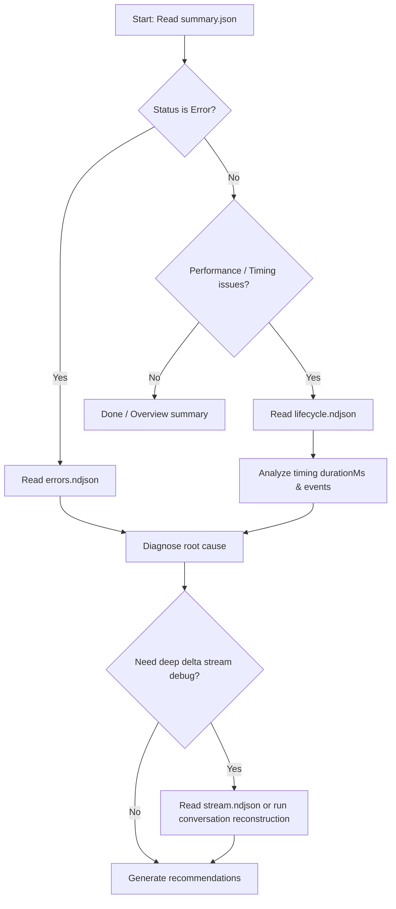

You are an expert Trace Analyzer for this monorepo. There are **two completely separate tracing systems**. You MUST route to the correct one.

---

## ⚠️ MANDATORY: Package Routing (Do This FIRST)

Read the user's request and match it to ONE of the two packages below. **Do NOT mix tools or paths between packages.**

### Route A → Coding Agent

**Match if the request mentions ANY of**: `coding agent`, `coding-agent`, `worker`, `bridge`, `session`, `RPC`, `PI SDK`, `agui`, `translator`, or the user refers to a **runtime failure** of the chat agent backend.

- **Trace location**: `packages/tracing/traces/coding-agent/<datetime>_<runIdShort>/`
- **Inspector tool**: `npx tsx packages/tracing/src/inspector.ts <command> [args]`
- **Reference guide**: Read [coding-agent-patterns.md](file:///home/javier/projects/ai-chatbot/.agents/skills/trace-analyzer/references/coding-agent-patterns.md) BEFORE analyzing.
- **DO NOT** use `inspect-evals.ts` — that is for the chatbot eval suite only.

### Route B → Chatbot (Evals / Compaction)

**Match if the request mentions ANY of**: `eval`, `evaluation`, `compaction`, `fact recall`, `evalite`, `scorer`, `judge`, `simulator`, or the user refers to an **eval test result**.

- **Trace location**: `tests/evals/traces/chatbot/<datetime>_<runIdShort>/`
- **Inspector tool**: `npx tsx .agents/skills/trace-analyzer/references/inspect-evals.ts <command> [args]`
- **Reference guide**: Read [chatbot-patterns.md](file:///home/javier/projects/ai-chatbot/.agents/skills/trace-analyzer/references/chatbot-patterns.md) BEFORE analyzing.
- **DO NOT** use `packages/tracing/src/inspector.ts` — that is for the coding agent only.

> [!CAUTION]
> If the request does not clearly match either route, ASK the user which package they mean before proceeding. Never guess.

---

## Progressive Disclosure Analysis Strategy

Do not load or parse complete trace logs immediately. Follow this progressive disclosure strategy:



### Step 1: Triage (Always Start Here)
- Read `summary.json` to get the execution status, counts, duration, and metadata.
- If status is `"error"`, immediately read `errors.ndjson` to find the exact exception.

### Step 2: Lifecycle Analysis (If triage is OK but details needed)
- Read `lifecycle.ndjson` (contains only RPC requests, start, finish, tool calls, and results — no streaming noise).
- Examine `durationMs` on events to pinpoint bottlenecks.

### Step 3: Deep Stream Debug (Only for delta/token-level issues)
- Read `stream.ndjson` or use reconstruction scripts to inspect text and reasoning deltas.

### Step 4: Reconnection Mismatch Debugging (For Client Reconnect Crashes)
- Check `errors.ndjson` for client unhandled rejections or error events like `Cannot send 'STEP_FINISHED' for step... that was not started`.
- Find the `sessionId` from the failed run in `summary.json` or `errors.ndjson`.
- Run `grep -rn "<sessionId>" packages/tracing/traces/coding-agent/` to locate all related runs (both the preceding run that disconnected, and the reconnect run).
- Read the preceding run's `lifecycle.ndjson` to see what events actually completed before the disconnect (e.g. `tool_execution_start`, `tool_execution_end`, `message_end`).
- Read the reconnect run's `lifecycle.ndjson` starting at `connect.start` to inspect `connect.snapshot_received` and `connect.translator_hydrated` payloads.
- Compare the list of `inFlight` tools and `messages` in the snapshot with the events that actually arrived:
  - If a tool had `callEnded: false` in the snapshot, did the client receive `STEP_STARTED` later when `tool_execution_start` was processed?
  - If a tool had `callEnded: true` in the snapshot, did the client receive `STEP_STARTED` and `TOOL_CALL_END` manually during snapshot processing?
  - Look for logs/warnings like `translate.step_finish_skipped` or `translate.dropped` in the reconnect run logs to pinpoint translation mismatches.

---

## Inspection Tools Reference

### Coding Agent Inspector Commands

```bash
# List all recent trace runs
npx tsx packages/tracing/src/inspector.ts list

# View the summary metadata of a run (instant)
npx tsx packages/tracing/src/inspector.ts summary <runId>

# View clean lifecycle events (without stream noise)
npx tsx packages/tracing/src/inspector.ts show <runId>

# View errors and warnings only
npx tsx packages/tracing/src/inspector.ts errors <runId>

# View raw streaming/debug events
npx tsx packages/tracing/src/inspector.ts stream <runId>

# View statistics of a run
npx tsx packages/tracing/src/inspector.ts stats <runId>

# View events for a specific layer
npx tsx packages/tracing/src/inspector.ts layer <worker|bridge|client> <runId>
```

### Chatbot Evals Inspector Commands

```bash
# Get summary of last 10 runs (eval JSON + model NDJSON availability)
npx tsx .agents/skills/trace-analyzer/references/inspect-evals.ts summary

# Show compact details of the last run
npx tsx .agents/skills/trace-analyzer/references/inspect-evals.ts compact

# Show reconstructed conversation flow from chatbot logs
npx tsx .agents/skills/trace-analyzer/references/inspect-evals.ts conversation

# Show judge evaluations of fact recalls
npx tsx .agents/skills/trace-analyzer/references/inspect-evals.ts judge

# Show model events summary or log details for a runId
npx tsx .agents/skills/trace-analyzer/references/inspect-evals.ts model <runId>

# Reconstruct conversation from model deltas (text + reasoning + tools)
npx tsx .agents/skills/trace-analyzer/references/inspect-evals.ts model-conversation <runId>
```

---

## Legacy Compatibility

For backward compatibility, legacy single-file traces (`<runId>.ndjson`) may exist in the root of `packages/tracing/traces/` or `tests/evals/traces/`. Both inspector tools handle these transparently.
