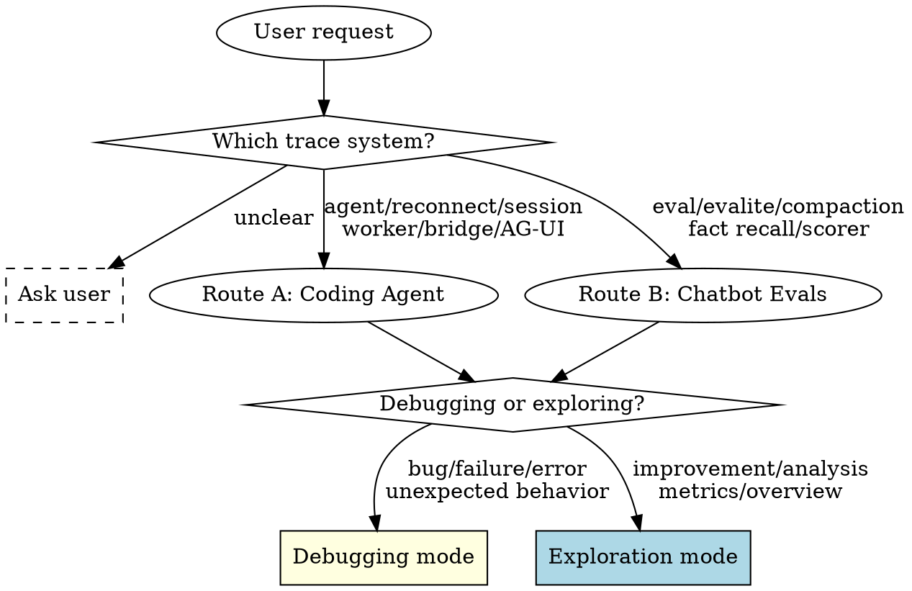

# Trace Analyzer

This monorepo has two trace systems. Route first, then determine your mode.

## Debugging Mode

Read `references/debugging-workflow.md` before analyzing. It pairs `superpowers:systematic-debugging` phases with trace-analyzer commands and defines the gate and reporting format.

## Exploration Mode

Run commands freely. No gates required.

Keep analysis progressive: summary → details → stream only if needed. Summarize findings and suggest improvement opportunities.

## Route A: Coding Agent

Use this route when the request mentions coding agent, reconnect, session id, worker, bridge, Pi SDK, AG-UI, translator, RPC, streaming, or runtime failures in the agent UI.

Trace location: `packages/tracing/traces/coding-agent/<datetime>_<runIdShort>/`

Inspector: `npx tsx packages/tracing/src/inspector.ts <command> [args]`

Read `references/coding-agent-patterns.md` for commands, reconnect invariants, high-signal events, and failure patterns.

## Route B: Chatbot Evals

Use this route when the request mentions eval, evaluation, evalite, compaction, fact recall, scorer, judge, simulator, or model quality metrics.

Trace location: `tests/evals/traces/chatbot/<datetime>_<runIdShort>/`

Inspector: `npx tsx .agents/skills/trace-analyzer/references/inspect-evals.ts <command> [args]`

Read `references/chatbot-patterns.md` for the analysis workflow and common compaction/tool failure patterns.

## Analysis Rules

- Keep analysis progressive: summary, errors, lifecycle, then stream only if necessary.
- Preserve context: quote short event names and compact payload facts, not whole trace records.
- Prefer cross-run session timelines for reconnect bugs; a single run usually hides the disconnect/reconnect boundary.
- If the request does not clearly match coding-agent or eval traces, ask which trace system the user means.
